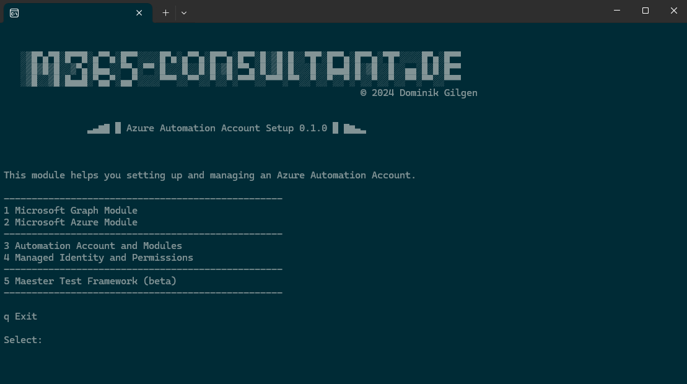

# AutomationAccountSetup
This module simplifies the configuration of an Azure Automation Account, allowing seamless execution of a Runbook using a Managed Identity.




Those are the key features of this module:
   - Microsoft Graph Module - _Installation, Connect, ..._
   - Microsoft Az Module - _Installation, Connect, ..._
   - Automation Account - _Module Management for the Graph Modules_
   - Managed Identity - _Assign Graph Scopes to the Managed Identity (like User.Read.All, etc.)_


_This module is currently in development and will receive additional features and functions in the future._

_Feel free to share any feature requests with me!_

# Installation
The module is published on [PowerShell Gallery](https://www.powershellgallery.com/packages/M365cde.AutomationAccountSetup/) and can be installed with this command within a powershell console:

    Install-Module -Name M365cde.AutomationAccountSetup -AllowPrerelease -Scope CurrentUser

# Start and usage
The module is controlled by a menu.
To start the Module you can use this command:
```
M365cdeAAASetup 
```

# Changelog
- v0.0.4
  - Fixed Exchange Online Scopes.
- v0.0.3
  - Simplyfied the code for scope assignment.
- v0.0.2
  - Changed the code for scope assignment.
- v0.0.1 First release
  - First release of this script
